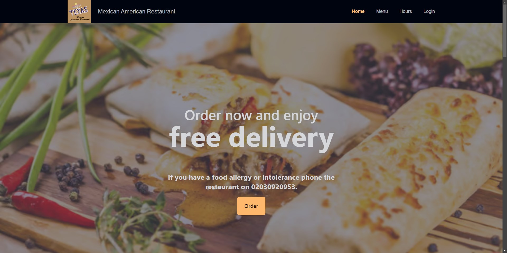

# 30 Website Redesigns

## Overview

This repository contains 30 website redesigns for various web pages. Starting from a basic template, each design was customized and improved upon. The project was completed over the course of one month, focusing on creating new websites for local businesses using React and Tailwind CSS.

## Project Structure

- Each redesign is stored in a separate branch
- The main branch contains the base template

## Collaboration

One of the websites was developed in collaboration with a remote designer:

- Used Figma for design handoff
- Transformed the designer's vision into a functional website

## Technologies Used

- React
- Tailwind CSS
- Git (for version control)
- Figma (for collaborative design work)

