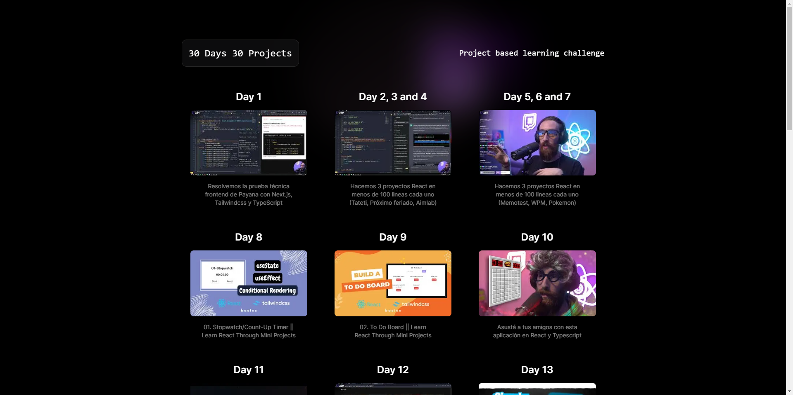

# 30 Web Projects in 30 Days

## 🚀 Project Overview

This repository contains my journey of completing 30 web projects in 30 days, following various tutorials. The projects are built using modern web technologies including React, Tailwind CSS, Next.js, and TypeScript.

## 🛠️ Technologies Used

- React
- Tailwind CSS
- Next.js
- TypeScript

## 🙏 Acknowledgements

A big thank you to all the tutorial creators whose guidance made this project possible.

